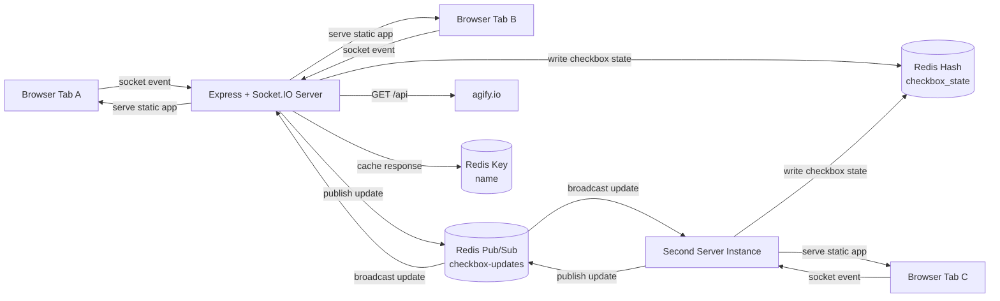

# RedisSocket

A small real-time demo that mixes three ideas in one place:

- `Socket.IO` for live updates in the browser
- `Redis` for shared state and pub/sub
- `Express` for static hosting and a tiny cached API example

Open the app in multiple tabs, click a checkbox, and the change shows up everywhere else almost immediately.

## What This Project Does

This app renders a board of `1000` checkboxes in the browser. When one client toggles a checkbox:

1. the browser emits a `checkbox-update` socket event
2. the Node server stores that value in Redis
3. the update is published through Redis pub/sub
4. every connected client receives the new state

There is also a small `/api` route that fetches data from `agify.io` once, stores the result in Redis, and serves the cached value on later requests.

## Architecture



## Project Shape

- `src/index.ts`: Express server, Socket.IO wiring, Redis integration, rate limiting, and API caching
- `public/index.html`: the browser UI for the real-time checkbox board
- `docker-compose.yml`: quick Redis container setup

## Quick Start

### 1. Install dependencies

```bash
pnpm install
```

If you prefer npm:

```bash
npm install
```

### 2. Start Redis

With Docker:

```bash
docker compose up -d
```

This exposes Redis on `localhost:6379`.

### 3. Build the app

```bash
npm run build
```

### 4. Start the server

Default port:

```bash
node dist/index.js
```

Custom port:

```bash
node dist/index.js 3001
```

You can also use an environment variable:

```bash
PORT=3001 node dist/index.js
```

On PowerShell:

```powershell
$env:PORT=3001
node dist/index.js
```

### 5. Open the app

Visit:

- `http://localhost:3000`
- `http://localhost:3001`

Then open the page in multiple tabs or windows and try toggling checkboxes.

## Running Two Server Instances

This project now supports custom ports, so you can run more than one Node server against the same Redis instance.

Example:

```bash
node dist/index.js 3000
node dist/index.js 3001
```

Why that matters:

- both servers read and write the same checkbox state in Redis
- pub/sub keeps updates flowing between instances
- clients connected to different ports still stay in sync

